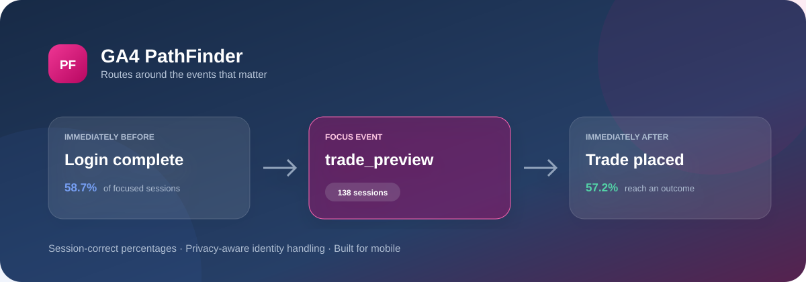

# GA4 PathFinder

<p align="center"></p>
<p align="center"><strong>A fast, mobile-first journey explorer for the raw Google Analytics 4 BigQuery export.</strong></p>
<p align="center">
  
  
  
  
</p>

PathFinder turns event-level GA4 data into an event-centred journey readout. Pick an event such as `trade_placed`, `form_event_v2`, or `account_opened` and see the routes that lead into it, what happens next, where sessions stop, and whether they reach a configured outcome.

## Why PathFinder

- **Answers first.** A decision-ready summary explains the dominant route and whether the event signals continuation, friction, or an outcome.
- **Session-correct percentages.** Every percentage uses distinct focused sessions as its denominator; repeated raw events cannot inflate a route.
- **Designed for phones.** Native controls, wrapping route names, compact cards, and no desktop chart squeezed into a small viewport.
- **Raw-export ready.** Queries partitioned GA4 tables directly with scan guards and a deliberately narrow event projection.
- **Privacy-aware.** Hashed browser/session keys only; component values are excluded.
- **Zero frontend dependencies.** Plain HTML, CSS, and JavaScript served by a small Python HTTP server.

## Quick start

```bash
python3 -m venv .venv
source .venv/bin/activate
python -m pip install -r requirements.txt
python web_app.py
```

Open [http://127.0.0.1:8501](http://127.0.0.1:8501). A realistic synthetic dataset loads automatically.

### GitHub Codespaces

Open the repository in Codespaces and run `bash run.sh`. Port `8501` is labelled **GA4 PathFinder** and opens automatically in preview.

## What it shows

| View | Question answered |
| --- | --- |
| Journey readout | What is the clearest interpretation of this event? |
| Session reach | How many filtered sessions contain it? |
| Context before | How often is an earlier recorded step available? |
| Continuation | How often does the journey continue or stop here? |
| Outcome afterwards | How often is a configured outcome reached at or after it? |
| Event neighbourhood | Which routes dominate each position around the event? |
| Common routes | Which complete route windows repeat most often? |

Filters are available for platform, journey, identity state, and two to five context steps on either side.

## Connect BigQuery

PathFinder uses Google Application Default Credentials:

```bash
gcloud auth application-default login
```

Then open **Data** in the app, confirm the project and GA4 dataset, start with one or two complete days, select **Estimate**, and load only when the scan is within the configured billing guard.

The query prunes `_TABLE_SUFFIX`, restricts event names, excludes `component_value`, and returns only hashed browser/session/identified keys. Copy [.env.example](.env.example) to `.env` to override defaults.

## Journey semantics

- Sequencing hashes `user_pseudo_id + ga_session_id`; a later `user_id` does not split the session.
- Missing GA session IDs use a clearly flagged inactivity fallback.
- Sessions and browser keys associated with multiple identified IDs remain visible as ambiguous.
- An identified ID is not assumed to represent an accepted customer.
- Cross-device and historical anonymous-to-known stitching are intentionally out of scope.

## Route configuration

Edit [config/route_rules.csv](config/route_rules.csv) to map raw URLs and events into stable business route names. Rules run in ascending priority and the first match wins. Unmatched pages remain visible as normalised paths.

## Architecture

```text
GA4 BigQuery export
       │
       ▼
guarded SQL projection ──► session + identity spine
                                   │
                                   ▼
                          event-centred aggregation
                                   │
                                   ▼
                         Python JSON API + native UI
```

The application deliberately avoids a frontend framework and charting library. See [web_app.py](web_app.py) for the HTTP API, [pathfinder/](pathfinder/) for transformation logic, and [static/](static/) for the interface.

## Development

```bash
make test       # full unit and HTTP suite
make run        # local server
make check      # syntax checks plus tests
```

The health endpoint is available at `/healthz`; interface metadata is at `/api/meta`.

Contributions are welcome—see [CONTRIBUTING.md](CONTRIBUTING.md), the [security policy](SECURITY.md), and the [code of conduct](CODE_OF_CONDUCT.md).

## Interpretation limits

- Coverage depends on analytics consent and tracking completeness.
- `analytics_storage` is a GA consent signal, not a substitute for a consent-receipt dataset.
- Page-view-only journeys cannot reveal submission, validation, or field-level friction.
- GA4 daily tables can receive late events for up to three days; production pipelines should reprocess recent partitions.

---

Built to make raw journey data useful on the screen people actually carry.
